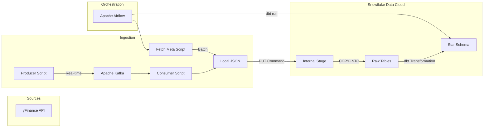
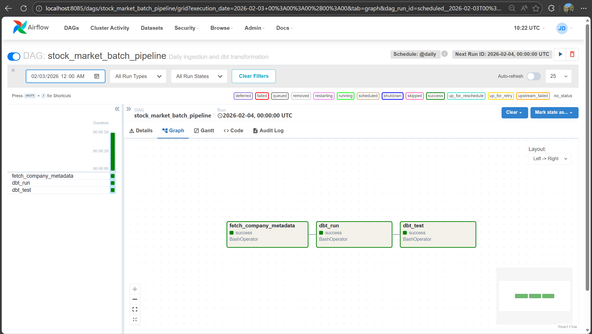
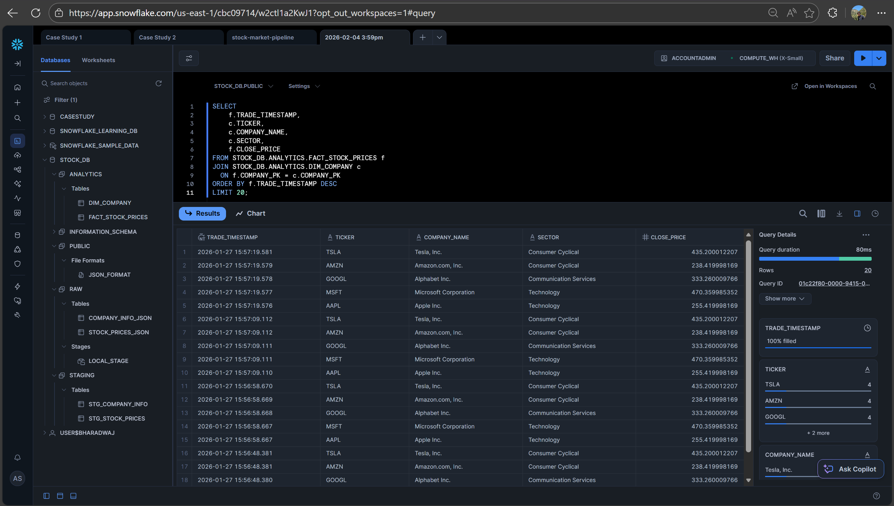
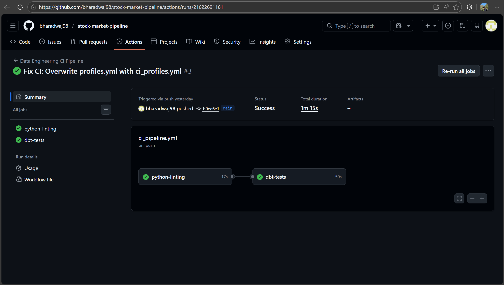

# 📈 End-to-End Hybrid Stock Market Data Engineering Pipeline


## 📖 Project Overview
This project implements a robust **Hybrid Data Engineering Pipeline** that ingests, processes, and models stock market data. It demonstrates the ability to handle both **Real-Time Streaming** (Stock Prices) and **Batch Processing** (Company Metadata) in a unified architecture.

The goal was to build a cost-effective, scalable data warehouse using **Snowflake**, orchestrated by **Airflow** (running in Docker), with transformations managed by **dbt** (data build tool) following the **Star Schema** methodology.

### 🏗 Architecture


## 🚀 Key Features
*   **Hybrid Ingestion:**
    *   **Streaming:** Python Producer/Consumer coupled with **Apache Kafka** to ingest real-time stock prices.
    *   **Batch:** Airflow DAGs to fetch company metadata (Sector, Industry, Market Cap) daily.
*   **Cost Optimization:**
    *   Leveraged **Snowflake Internal Stages** and the `PUT` command to bypass external cloud storage costs (AWS S3/Azure Blob), simulating a Data Lake directly within Snowflake.
*   **Data Modeling:**
    *   Raw JSON data is transformed into a **Star Schema** (Fact & Dimension tables) using **dbt**.
    *   Implemented **Deduplication Logic** in staging models to handle append-only logs.
*   **Infrastructure as Code:**
    *   Entire stack (Airflow, Kafka, Postgres, Zookeeper) containerized using **Docker Compose**.
*   **CI/CD Pipeline:**
    *   **GitHub Actions** pipeline that automatically lints Python code (`flake8`) and tests dbt models (`dbt test`) on every push.

---

## 🛠 Tech Stack

| Component | Tools Used | Description |
| :--- | :--- | :--- |
| **Orchestration** | Apache Airflow, Docker | Scheduling batch jobs and managing dependencies. |
| **Streaming** | Apache Kafka, Zookeeper | Message broker for real-time stock ticks. |
| **Warehousing** | Snowflake | Storage, Compute, and "Internal Stage" Data Lake. |
| **Transformation** | dbt (data build tool) | SQL-based transformation, testing, and documentation. |
| **Ingestion** | Python, Pandas, yFinance | Custom extraction scripts. |
| **CI/CD** | GitHub Actions | Automated Linting and Integration Testing. |

---

## 🔁 Pipeline Execution (Airflow)
The entire batch process and transformation logic is orchestrated via Airflow DAGs. Below is the successful execution graph showing the dependency flow from Metadata Ingestion &rarr; dbt Run &rarr; dbt Test.



---

## 📊 Data Model (Star Schema)
The raw JSON data is flattened and modeled into an analytics-ready schema:

*   **`RAW` Schema:** Landing zone for JSON data.
*   **`STAGING` Schema:** Deduplicated and cleaned views.
*   **`ANALYTICS` Schema:** Final Star Schema.



---

## 💻 Setup & Installation

### Prerequisites
*   Docker Desktop installed.
*   Snowflake Account (Free Trial works).
*   Python 3.9+.

### 1. Clone the Repository
```bash
git clone https://github.com/bharadwaj98/stock-market-pipeline.git
cd stock-market-pipeline
```

### 2. Configure Snowflake
Run the SQL script located in `scripts/snowflake_setup.sql` to create the Database, Warehouse, and Stages.

### 3. Environment Setup
Create a `profiles.yml` file in the root directory for local dbt execution:
```yaml
dbt_project:
  target: dev
  outputs:
    dev:
      type: snowflake
      account: YOUR_ACCOUNT
      user: YOUR_USER
      password: YOUR_PASSWORD
      # ... rest of config
```

### 4. Run Infrastructure (Docker)
Start Kafka, Zookeeper, and Airflow:
```bash
docker-compose up -d --build
```

### 5. Access Airflow
*   URL: `http://localhost:8085`
*   User: `admin`
*   Pass: `admin`
*   Trigger the `stock_market_batch_pipeline` DAG.

### 6. Run Streaming (Optional)
To simulate real-time data:
```bash
# Terminal 1
python scripts/producer.py

# Terminal 2
python scripts/consumer.py
```

---

## ✅ CI/CD & Testing
The project includes a GitHub Actions pipeline that ensures code quality.
*   **Linting:** Checks Python scripts for syntax errors.
*   **Integration Tests:** Connects to Snowflake and runs `dbt test` to verify data integrity.



---

## 🔮 Future Improvements
*   Visualize data using Streamlit or Tableau connected to Snowflake.
*   Deploy Airflow to AWS MWAA or Kubernetes.
*   Implement "Incremental Models" in dbt for larger datasets.